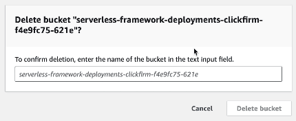

  

# Clickfirm

Sick of constantly laboring over all those annoying AWS Console "to confirm type" text fields?

Clickfirm is a Chrome extension that automates all that for you. Double-click on the text field and the placeholder will be entered as the value. You're done!

The extension is [available from the Chrome Web Store](https://chromewebstore.google.com/detail/clickfirm/nlicabmmjfpciepfihhkaokihemippbm)
